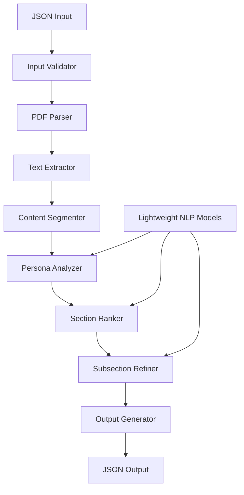

# Design Document

## Overview

The Multi-Collection PDF Analysis System is designed as a lightweight, CPU-only solution that processes PDF documents and extracts persona-relevant content using natural language processing techniques. The system operates under strict constraints (≤1GB model size, ≤60 seconds processing time, CPU-only) while maximizing scoring potential through intelligent section ranking and content refinement.

The architecture follows a pipeline approach: PDF parsing → text extraction → content segmentation → persona-based analysis → ranking → output generation. The system uses lightweight NLP models and efficient algorithms to meet performance requirements while delivering high-quality results.

## Architecture

### High-Level Architecture



### Component Architecture

The system is organized into distinct processing modules:

1. **Input Processing Layer**: Handles JSON validation and document loading
2. **PDF Processing Layer**: Extracts text content with page number preservation
3. **Analysis Layer**: Performs persona-based content analysis and ranking
4. **Output Layer**: Generates structured JSON responses

### Model Selection Strategy

Given the 1GB constraint, the system uses:
- **Sentence Transformers**: Lightweight embedding models (≤400MB) for semantic similarity
- **spaCy**: Efficient NLP pipeline (≤200MB) for text processing
- **Custom Ranking Algorithms**: Rule-based and statistical approaches for content prioritization
- **PDF Processing**: PyMuPDF (fitz) for efficient text extraction

## Components and Interfaces

### 1. Input Validator Component

**Purpose**: Validates and parses JSON input according to challenge specifications

**Interface**:
```python
class InputValidator:
    def validate_input(self, json_data: dict) -> ValidationResult
    def extract_challenge_info(self, json_data: dict) -> ChallengeInfo
    def extract_documents(self, json_data: dict) -> List[DocumentInfo]
    def extract_persona(self, json_data: dict) -> PersonaInfo
    def extract_job_to_be_done(self, json_data: dict) -> JobInfo
```

**Key Features**:
- Schema validation against required fields
- Error handling with descriptive messages
- Support for multiple test case formats

### 2. PDF Parser Component

**Purpose**: Extracts text content from PDF documents with page number tracking

**Interface**:
```python
class PDFParser:
    def extract_text_with_pages(self, pdf_path: str) -> List[PageContent]
    def extract_document_structure(self, pdf_path: str) -> DocumentStructure
    def handle_parsing_errors(self, pdf_path: str) -> ErrorInfo
```

**Key Features**:
- Page-by-page text extraction using PyMuPDF
- Preservation of document structure and formatting
- Error handling for corrupted or unreadable PDFs
- Efficient memory usage for large documents

### 3. Content Segmenter Component

**Purpose**: Divides extracted text into logical sections and subsections

**Interface**:
```python
class ContentSegmenter:
    def segment_by_headers(self, text: str) -> List[Section]
    def segment_by_topics(self, text: str) -> List[Section]
    def identify_section_boundaries(self, text: str) -> List[Boundary]
    def extract_section_titles(self, sections: List[Section]) -> List[str]
```

**Key Features**:
- Header-based segmentation using regex patterns
- Topic-based segmentation using sentence embeddings
- Adaptive segmentation based on document type
- Section title extraction and normalization

### 4. Persona Analyzer Component

**Purpose**: Analyzes content relevance based on persona characteristics and job requirements

**Interface**:
```python
class PersonaAnalyzer:
    def analyze_persona_relevance(self, content: str, persona: PersonaInfo) -> float
    def analyze_job_relevance(self, content: str, job: JobInfo) -> float
    def extract_persona_keywords(self, persona: PersonaInfo) -> List[str]
    def calculate_combined_relevance(self, content: str, persona: PersonaInfo, job: JobInfo) -> float
```

**Key Features**:
- Semantic similarity using sentence transformers
- Keyword-based relevance scoring
- Domain-specific analysis for travel, HR, and culinary contexts
- Combined scoring algorithm for persona + job alignment

### 5. Section Ranker Component

**Purpose**: Ranks extracted sections by importance and relevance

**Interface**:
```python
class SectionRanker:
    def rank_sections(self, sections: List[Section], persona: PersonaInfo, job: JobInfo) -> List[RankedSection]
    def calculate_importance_score(self, section: Section, context: AnalysisContext) -> float
    def apply_ranking_algorithm(self, scores: List[float]) -> List[int]
    def optimize_for_scoring_criteria(self, ranked_sections: List[RankedSection]) -> List[RankedSection]
```

**Key Features**:
- Multi-factor ranking algorithm combining relevance, uniqueness, and completeness
- Optimization for competition scoring criteria (60 points for section relevance)
- Adaptive ranking based on document collection characteristics
- Tie-breaking mechanisms for similar relevance scores

### 6. Subsection Refiner Component

**Purpose**: Extracts and refines subsection content for detailed analysis

**Interface**:
```python
class SubsectionRefiner:
    def extract_subsections(self, section: Section) -> List[Subsection]
    def refine_text_content(self, subsection: Subsection) -> str
    def maintain_factual_accuracy(self, original: str, refined: str) -> bool
    def optimize_for_readability(self, text: str) -> str
```

**Key Features**:
- Intelligent subsection extraction based on content structure
- Text refinement while preserving original meaning
- Quality optimization for subsection relevance scoring (40 points)
- Factual accuracy validation

### 7. Output Generator Component

**Purpose**: Generates structured JSON output according to challenge specifications

**Interface**:
```python
class OutputGenerator:
    def generate_metadata(self, input_data: dict, timestamp: str) -> dict
    def format_extracted_sections(self, ranked_sections: List[RankedSection]) -> List[dict]
    def format_subsection_analysis(self, refined_subsections: List[Subsection]) -> List[dict]
    def create_final_output(self, metadata: dict, sections: List[dict], subsections: List[dict]) -> dict
```

**Key Features**:
- Compliant JSON output formatting
- Timestamp generation in ISO format
- Comprehensive metadata inclusion
- Error handling and validation

## Data Models

### Core Data Structures

```python
@dataclass
class DocumentInfo:
    filename: str
    title: str
    content: str
    pages: List[PageContent]

@dataclass
class PageContent:
    page_number: int
    text: str
    structure_info: Optional[dict]

@dataclass
class PersonaInfo:
    role: str
    expertise_areas: List[str]
    focus_keywords: List[str]

@dataclass
class JobInfo:
    task: str
    requirements: List[str]
    success_criteria: List[str]

@dataclass
class Section:
    document: str
    title: str
    content: str
    page_number: int
    relevance_score: float
    importance_rank: int

@dataclass
class Subsection:
    document: str
    refined_text: str
    page_number: int
    quality_score: float
```

### Analysis Context

```python
@dataclass
class AnalysisContext:
    persona: PersonaInfo
    job: JobInfo
    document_collection: List[DocumentInfo]
    processing_constraints: ProcessingConstraints
    scoring_optimization: ScoringConfig
```

## Error Handling

### Error Categories and Strategies

1. **PDF Processing Errors**
   - Corrupted files: Log error, continue with remaining documents
   - Unreadable content: Attempt alternative extraction methods
   - Large files: Implement streaming processing

2. **Input Validation Errors**
   - Malformed JSON: Return descriptive error messages
   - Missing required fields: Provide field-specific error details
   - Invalid file paths: Validate document accessibility

3. **Processing Timeout Errors**
   - Implement progressive timeout handling
   - Prioritize most important content when approaching limits
   - Return partial results with status indicators

4. **Memory Constraint Errors**
   - Implement efficient memory management
   - Process documents in batches if necessary
   - Use streaming approaches for large content

### Error Response Format

```python
@dataclass
class ErrorResponse:
    error_type: str
    error_message: str
    partial_results: Optional[dict]
    processing_status: str
    timestamp: str
```

## Testing Strategy

### Unit Testing

1. **Component Testing**
   - PDF parser accuracy with various document types
   - Content segmentation quality validation
   - Ranking algorithm correctness
   - Output format compliance

2. **Performance Testing**
   - Processing time validation (≤60 seconds)
   - Memory usage monitoring (≤1GB)
   - CPU utilization optimization

3. **Integration Testing**
   - End-to-end pipeline validation
   - Multi-collection processing
   - Error handling scenarios

### Test Case Coverage

1. **Provided Test Cases**
   - Travel planning scenario validation
   - HR/Acrobat forms processing
   - Recipe collection analysis

2. **Edge Cases**
   - Empty or corrupted PDFs
   - Extremely large documents
   - Unusual persona/job combinations
   - Timeout scenarios

3. **Scoring Optimization**
   - Section relevance maximization
   - Subsection quality validation
   - Ranking accuracy verification

### Performance Benchmarks

- **Processing Time**: Target ≤45 seconds for 3-5 document collections
- **Memory Usage**: Target ≤800MB peak usage
- **Accuracy Metrics**: Section relevance precision ≥85%, subsection quality score ≥80%

## Implementation Considerations

### Technology Stack

- **Python 3.8+**: Core runtime environment
- **PyMuPDF (fitz)**: PDF text extraction
- **sentence-transformers**: Lightweight embedding models
- **spaCy**: NLP processing pipeline
- **scikit-learn**: Machine learning utilities
- **Docker**: Containerization for deployment

### Model Selection Rationale

1. **Sentence Transformers**: 
   - Model: `all-MiniLM-L6-v2` (≤80MB)
   - Provides good semantic similarity with minimal resource usage
   - Supports multilingual content if needed

2. **spaCy Pipeline**:
   - Model: `en_core_web_sm` (≤50MB)
   - Efficient text processing and entity recognition
   - Good performance for content segmentation

3. **Custom Algorithms**:
   - Rule-based ranking for domain-specific optimization
   - Statistical approaches for content quality assessment
   - Hybrid scoring combining multiple factors

### Optimization Strategies

1. **Processing Efficiency**
   - Parallel processing where possible
   - Efficient data structures and algorithms
   - Memory-conscious implementation

2. **Scoring Optimization**
   - Tuned ranking algorithms for competition criteria
   - Quality metrics aligned with evaluation rubric
   - Adaptive approaches for different document types

3. **Resource Management**
   - Lazy loading of models and data
   - Efficient memory cleanup
   - Progressive processing with early termination if needed